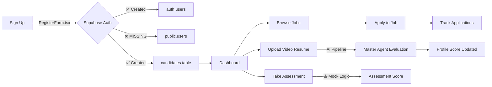
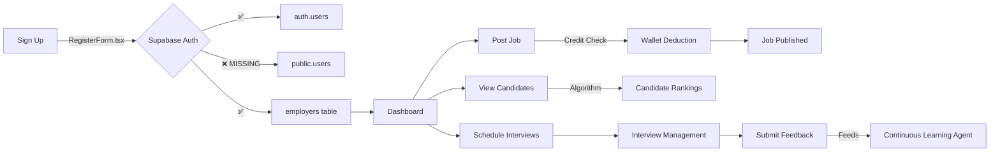
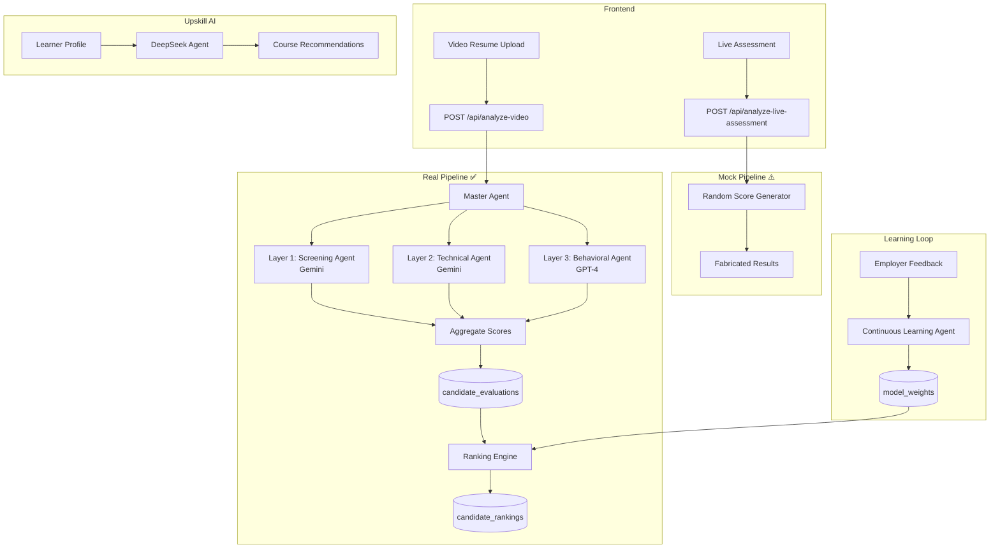

# HireGo AI Platform — Comprehensive Audit Report

**Date:** 2026-02-16 (Updated)  
**Auditor:** Vibe Coding Agent (Antigravity)  
**Scope:** Authentication, Security, Workflows, AI/LLM Integration, Database, System Architecture  
**Status:** Audit-Only — No code modifications made

---

## Executive Summary

The HireGo AI platform is an ambitious multi-portal hiring and upskilling system featuring AI-driven candidate evaluation, video resume analysis, algorithmic job matching, and a learning management system. The codebase is substantial: **42 database tables**, **11 AI agents**, **6 backend route modules**, and **5 frontend portal destinations** (Candidate, Employer, Admin, Upskill, Educator).

While the feature set is impressive, this audit reveals **several critical security vulnerabilities** that must be resolved before any production deployment. The most severe finding is that **all 42 database tables have RLS policies set to `USING (true)`**, rendering Row-Level Security entirely ineffective. Combined with unprotected API endpoints and development-mode authentication bypasses, the platform currently has **no effective access control** at the database layer.

### Risk Summary

| Severity | Count | Key Findings |
|:---------|:------|:-------------|
| 🔴 **CRITICAL** | 5 | RLS policies are all public, AI routes unprotected, registration bypass unprotected, dev-mode auth bypass, service-role key used as default |
| 🟠 **HIGH** | 3 | `public.users` not populated on registration, wallet deduction race conditions, encryption key defaults |
| 🟡 **MEDIUM** | 4 | Mock AI endpoints in production paths, redundant video analysis endpoints, YouTube OAuth hardcoded to localhost, CORS wide-open |
| 🔵 **LOW** | 3 | Redundant localStorage token storage, duplicate badge route, missing `SUPABASE_SERVICE_ROLE_KEY` in `.env.example` |

---

## 1. Authentication & Security Audit

### 1.1 Supabase Auth Integration Status

| Module | Auth Method | Frontend File | Status | Notes |
|:-------|:-----------|:-------------|:-------|:------|
| **Candidate Portal** | Supabase Auth | `RegisterForm.tsx` | ⚠️ Partial | Creates `auth.users` + `candidates` but **skips `public.users`** |
| **Employer Portal** | Supabase Auth | `RegisterForm.tsx` | ⚠️ Partial | Same gap — no `public.users` record created |
| **Admin Panel** | Supabase Auth | `AdminLogin.tsx` | ✅ Secure | Validates role from `public.users` table |
| **Upskill Portal** | Supabase Auth | `UpskillRegistration.tsx` | ✅ Secure | Correctly populates `auth.users`, `public.users`, and `upskill_learners` |
| **Educator Portal** | Supabase Auth | (shared) | ⚠️ Unverified | Educator pages exist but dedicated registration flow not found |

**Impact of `public.users` Gap:**
- Candidates and Employers created via `RegisterForm.tsx` exist in Supabase `auth.users` but **not in `public.users`**
- The Admin panel's `UserManagement.tsx` queries `public.users` — these users are invisible to admins
- The `GET /api/profile` endpoint queries `public.users` first — orphaned users get errors
- The `candidates` and `employers` tables have `REFERENCES users(id) ON DELETE CASCADE`, so the FK relationship is broken if the `public.users` row doesn't exist

### 1.2 Backend Authentication Middleware

**File:** `server/index.js` (lines 121–168)

The `authenticateUser` middleware has **three bypass paths** in development mode:

```
Bypass 1: No Supabase configured  → Skip auth entirely (line 123-126)
Bypass 2: No auth header          → Mock user "demo-candidate-001" (line 131-135)  
Bypass 3: Invalid/expired token   → Mock user "demo-candidate-001" (line 152-156)
```

**Risk:** If `NODE_ENV` is not explicitly set to `'production'` in deployment (e.g., on a staging server), all authenticated routes effectively become public.

### 1.3 Critical Security Vulnerabilities

#### 🔴 CRITICAL-1: RLS Policies Grant Full Public Access

**File:** `server/hirego_complete_schema.sql` (lines 959–1003)

```sql
-- This is applied to ALL 42 tables:
CREATE POLICY "Public Access" ON users FOR ALL USING (true) WITH CHECK (true);
CREATE POLICY "Public Access" ON wallet FOR ALL USING (true) WITH CHECK (true);
CREATE POLICY "Public Access" ON payments FOR ALL USING (true) WITH CHECK (true);
CREATE POLICY "Public Access" ON admin_users FOR ALL USING (true) WITH CHECK (true);
-- ... (all 42 tables)
```

**Impact:** While RLS is enabled on every table (`ALTER TABLE ... ENABLE ROW LEVEL SECURITY`), every policy uses `USING (true)`, which means **anyone with the Supabase anon key can read, insert, update, and delete ANY row in ANY table**. This includes:
- `wallet` — Anyone can modify wallet balances
- `payments` — Anyone can view payment details
- `admin_users` — Anyone can grant themselves admin access
- `transactions` — Anyone can view or modify financial records
- `session_recordings` — Anyone can access interview recordings

**This is the single most critical vulnerability in the platform.**

#### 🔴 CRITICAL-2: AI Routes Are Completely Unprotected

**File:** `server/index.js` (line 1121)
```javascript
setupAIRoutes(app, supabase, decrypt);
// Note: `authenticateUser` is NOT passed as an argument
```

**File:** `server/routes/ai_routes.js`  
The `setupAIRoutes` function signature is `setupAIRoutes(app, supabase, decrypt)` — it never receives the auth middleware. All AI endpoints are therefore publicly accessible:
- `POST /api/analyze-live-assessment` — Assessment analysis
- `POST /api/ai/analyze-video` — Video analysis  
- `POST /api/generate-questions` — Question generation
- `POST /api/ai/evaluate-candidate` — Full candidate evaluation
- `POST /api/ai/skill-mapping` — Skill analysis
- `POST /api/ai/training/trigger` — Model retraining trigger
- `GET /api/ai/performance-report` — System performance data
- `GET /api/ai/training/status` — Training data

#### 🔴 CRITICAL-3: Registration Bypass Endpoint Unprotected

**File:** `server/index.js` (lines 170–203)
```javascript
app.post('/api/auth/register', async (req, res) => {
    // Uses supabase.auth.admin.createUser() — NO authenticateUser middleware
});
```

This endpoint uses the **admin API** to create users (bypassing rate limits and email verification). It has **no authentication middleware** applied, meaning anyone can call it to create confirmed user accounts without rate limiting.

#### 🔴 CRITICAL-4: Service Role Key Used as Default Supabase Client

**File:** `server/index.js` (lines 54–61)
```javascript
if (serviceKey) {
    supabaseKey = serviceKey;
    console.log('Using SUPABASE_SERVICE_ROLE_KEY for elevated privileges');
}
```

When `SUPABASE_SERVICE_ROLE_KEY` is available, the **entire backend** uses it as the Supabase client key. The service role key **bypasses all RLS policies**. This means even if proper RLS policies were implemented, the server-side queries would ignore them entirely.

**This should be a separate admin client** — the default client should use the anon key and rely on proper RLS.

#### 🔴 CRITICAL-5: Default Encryption Key

**File:** `server/index.js` (line 75)
```javascript
const ENCRYPTION_KEY = process.env.ENCRYPTION_KEY || 'default-encryption-key-change-in-production';
```

If `ENCRYPTION_KEY` is not set, all API keys stored in the database are encrypted with a publicly known default key, making the encryption useless.

### 1.4 Additional Security Observations

| Finding | Severity | Location | Details |
|:--------|:---------|:---------|:--------|
| CORS is wide-open | 🟡 MEDIUM | `index.js` line 46 | `app.use(cors())` with no origin restrictions |
| Rate limiter is global 100/15min | 🔵 INFO | `index.js` lines 36-43 | May be too restrictive for API-heavy frontends |
| YouTube OAuth redirect is localhost | 🟡 MEDIUM | `youtube_agent.js` line 18 | Hardcoded `http://localhost:3000/auth/callback` |
| Helmet is applied | ✅ GOOD | `index.js` line 32 | XSS, clickjacking protection enabled |
| Morgan logging is applied | ✅ GOOD | `index.js` line 33 | Request logging enabled |

---

## 2. Database Architecture Audit

### 2.1 Schema Overview

**File:** `server/hirego_complete_schema.sql` — 42 tables across 7 domains:

| Domain | Tables | Key Tables |
|:-------|:-------|:-----------|
| **Users & Identity** | 5 | `users`, `user_profiles`, `candidates`, `employers`, `educators` |
| **Jobs & Hiring** | 7 | `employer_job_posts`, `job_applications`, `screening_results`, `interviews`, `interview_feedback`, `interview_logs`, `pay_per_hire_records` |
| **Upskill/LMS** | 8 | `courses`, `course_lessons`, `course_quizzes`, `course_assignments`, `assignment_submissions`, `live_classes`, `candidate_progress`, `candidate_certificates` |
| **Assessments** | 3 | `candidate_assessments`, `video_interview_sessions`, `session_recordings` |
| **Finance** | 5 | `wallet`, `wallet_transactions`, `transactions`, `payments`, `subscription_plans`, `employer_subscriptions` |
| **Admin & CRM** | 8 | `admin_users`, `admin_settings`, `staff_users`, `staff_activity`, `crm_leads`, `notifications`, `platform_reports`, `email_logs` |
| **System** | 3 | `analytics`, `routes_registry`, `candidate_activity_log`, `employer_activity_log` |

### 2.2 Schema Quality Assessment

| Aspect | Status | Notes |
|:-------|:-------|:------|
| Primary Keys | ✅ Well-defined | Mix of TEXT (user IDs) and BIGINT IDENTITY |
| Foreign Keys | ✅ Comprehensive | CASCADE deletes on user-owned tables |
| Indexes | ✅ Good coverage | Indexes on search columns, FKs, dates |
| CHECK constraints | ✅ Present | Enum-like constraints on status/type fields |
| JSONB usage | ⚠️ Heavy | Skills, metadata, preferences stored as JSONB — not queryable without indexes on JSONB paths |
| `users.id` type | 🟠 TEXT | Should ideally be UUID to match `auth.users(id)`. The RLS fix script (`fix_rls_type_mismatch.sql`) addresses the cast issue |

### 2.3 Missing Tables

The following tables are referenced in code but **not present** in `hirego_complete_schema.sql`:

| Table | Referenced In | Purpose |
|:------|:-------------|:--------|
| `api_keys` | `index.js`, `ai_routes.js` | Stores encrypted LLM API keys |
| `upskill_learners` | `upskill_routes.js` | Upskill-specific learner profiles |
| `skill_mappings` | `skill_mapping_agent.js` | Cached skill requirements per role |
| `candidate_evaluations` | `performance_tracking_agent.js` | AI evaluation results |
| `video_analysis_results` | `performance_tracking_agent.js`, `video_processing_agent.js` | Video AI analysis output |
| `model_training_logs` | `continuous_learning_agent.js` | ML model training history |
| `employer_feedback` | `ranking_engine.js`, `continuous_learning_agent.js` | Employer hiring decisions |
| `model_weights` | `continuous_learning_agent.js` | AI model weight configurations |
| `system_performance_metrics` | `performance_tracking_agent.js` | Daily system KPIs |
| `candidate_rankings` | `ranking_engine.js` | Computed candidate rankings |
| `candidate_experience` | `portal_routes.js` | Work experience breakdown |
| `candidate_skills` | `portal_routes.js` | Individual skill records |

These need to either be added to the unified schema or verified as existing in separate migration files.

---

## 3. Portal Workflows & User Experience

### 3.1 Candidate Journey



**Candidate Frontend Pages (13 files):**
- `Dashboard.tsx` — Overview with stats
- `Jobs.tsx` — Browse and search jobs
- `Applications.tsx` — Track submitted applications
- `Profile.tsx` — Edit profile (26KB, comprehensive)
- `VideoResume.tsx` — Record/upload video resume
- `LiveAssessment.tsx` — Live AI assessment (mock logic)
- `Assessments.tsx` — Assessment list/history
- `AssessmentResult.tsx` — View individual results
- `Interview.tsx` — Interview preparation/joining
- `CandidateInterviews.tsx` — Interview schedule list
- `Settings.tsx` — Account settings
- `Connections.tsx` — Networking feature
- `GamificationDashboard.tsx` — Badges and achievements

### 3.2 Employer Journey



**Employer Frontend Pages (13 files):**
- `Dashboard.tsx` — Analytics and overview
- `PostJob.tsx` / `JobPostingForm.tsx` (81KB — very large) — Job creation
- `MyJobs.tsx` — Manage posted jobs
- `JobDetail.tsx` — View job with applicants
- `Candidates.tsx` (36KB) — Browse/search candidates
- `CandidateProfileView.tsx` (37KB) — Detailed candidate profile
- `CandidateRankings.tsx` — AI-ranked candidates
- `Interviews.tsx` — Interview list
- `InterviewSchedule.tsx` (34KB) — Schedule management
- `ProctoredInterview.tsx` — AI-proctored interview
- `MakeAgreement.tsx` — Pay-per-hire agreements
- `Settings.tsx` — Company settings

### 3.3 Admin Panel

**Admin Frontend Pages (17 files):**
- `Dashboard.tsx` (31KB) — Platform overview
- `UserManagement.tsx` (28KB) — CRUD users
- `AdminLogin.tsx` — Login with role check
- `AIControl.tsx` — AI agent configuration
- `APIConfig.tsx` — API key management
- `ProctoringConfig.tsx` — Anti-cheating settings
- `InterviewManagement.tsx` — Oversee all interviews
- `PerformanceAnalytics.tsx` — System performance
- `SystemLogs.tsx` — Activity logs
- `JobPricingControl.tsx` (84KB — very large) — Credit/pricing management
- `CreditSystemControl.tsx` — Credit allocation
- `PaymentConfig.tsx` — Payment gateway setup
- `EmailConfig.tsx` — Email service configuration
- `VideoStorageConfig.tsx` — YouTube/storage config
- `PageEditor.tsx` — CMS-like page editing
- `UpskillCourseManagement.tsx` — Course CRUD
- `UpskillLearnerProgress.tsx` — Learner analytics

### 3.4 Backend Route Modules

| Module | File | Auth Passed? | Endpoints |
|:-------|:-----|:------------|:----------|
| **AI Routes** | `ai_routes.js` | ❌ **NO** | 8+ endpoints for AI evaluation, training, skill mapping |
| **Admin Routes** | `admin_routes.js` | ✅ Yes | 40+ endpoints (all use `authenticateUser`) |
| **Portal Routes** | `portal_routes.js` | ✅ Yes | 20+ endpoints for jobs, applications, interviews, profiles |
| **Page Routes** | `page_routes.js` | ✅ Yes | CMS page management |
| **Payment Routes** | `payment_routes.js` | ✅ Yes | Stripe/Razorpay integration |
| **Engagement Routes** | `engagement_routes.js` | ✅ Yes | Messaging, conversations, notifications |
| **Upskill Routes** | `upskill_routes.js` | ⚠️ Partial | Mounted as Express router; internal auth varies per route |

**Additional unprotected routes in `index.js`:**
- `POST /api/auth/register` — No auth (CRITICAL)
- `POST /api/analyze-video` — No auth (uses Master Agent directly)
- `POST /api/generate-job-description` — No auth (mock endpoint)

---

## 4. AI & LLM Integration Audit

### 4.1 Complete AI Agent Inventory

| Agent | File | LLM Used | Status | Responsibility |
|:------|:-----|:---------|:-------|:---------------|
| **Master Agent** | `master_agent.js` | Orchestrator | ✅ Real | Coordinates 3-layer evaluation: Screening → Technical → Behavioral. Produces weighted final score. |
| **Screening Agent (L1)** | `layer1_screening.js` | Gemini | ✅ Real + Fallback | Evaluates profile completeness, skill relevance, experience. Falls back to mock if AI unavailable. |
| **Technical Agent (L2)** | `layer2_technical.js` | Gemini | ✅ Real + Fallback | Analyzes technical accuracy, knowledge depth, terminology from transcription. |
| **Behavioral Agent (L3)** | `layer3_behavioral.js` | GPT-4 | ✅ Real + Fallback | Analyzes communication style, confidence, emotional tone, soft skills. |
| **Video Processing Agent** | `video_processing_agent.js` | Gemini/GPT-4 | ⚠️ Mostly Mock | Metadata extraction, transcription (simulated), sentiment analysis (simulated), topic extraction. |
| **Ranking Engine** | `ranking_engine.js` | None (Algorithmic) | ✅ Real | Composite scoring: skill match, experience, interview performance, employer feedback, recency. |
| **Skill Mapping Agent** | `skill_mapping_agent.js` | Gemini | ✅ Real + Fallback | Maps candidate skills against role requirements. Caches results in `skill_mappings` table. |
| **Continuous Learning Agent** | `continuous_learning_agent.js` | None (Heuristic) | ⚠️ Rudimentary | Adjusts model weights based on employer feedback patterns. Not true ML — uses heuristic rules. |
| **Performance Tracking Agent** | `performance_tracking_agent.js` | None (Analytics) | ✅ Real | Tracks daily KPIs: hiring success rate, agent processing times, model accuracy, API costs. |
| **DeepSeek Agent** | `deepseek_agent.js` | DeepSeek API | ✅ Real + Fallback | Generates personalized course recommendations, learning insights, live class suggestions for Upskill module. |
| **YouTube Agent** | `youtube_agent.js` | None (API) | ✅ Real | Uploads videos to YouTube via Google API. Used for video resume storage. |
| **YouTube Live Agent** | `youtube_live_agent.js` | None (API) | ✅ Real | Creates/manages live broadcasts for Upskill live classes. Full CRUD for broadcasts, playlists. |

### 4.2 AI Utility Layer

**File:** `server/agents/ai_utils.js`

Provides a universal `generateAIResponse()` function that:
1. Accepts a preferred provider (`gemini` or `openai`)
2. Attempts the preferred provider first
3. Falls back to the other provider on failure
4. Returns raw text response

**LLM API Configuration:**
- Gemini API key stored encrypted in `api_keys` table
- OpenAI API key stored encrypted in `api_keys` table
- DeepSeek API key stored encrypted in `api_keys` table
- Keys decrypted at runtime using `decrypt()` function

### 4.3 Matching & Scoring Algorithm

**Ranking Engine (`ranking_engine.js`):**

```
Composite Score = (Skill Match % × W₁) + (Experience Score × W₂) + 
                  (Interview Score × W₃) + (Feedback Score × W₄) + 
                  (Recency Boost × W₅)

Default Weights:
  W₁ (Skills)     = 0.30
  W₂ (Experience) = 0.25  
  W₃ (Interview)  = 0.20
  W₄ (Feedback)   = 0.15
  W₅ (Recency)    = 0.10
```

The Continuous Learning Agent adjusts these weights based on employer hiring patterns (e.g., if employers consistently hire candidates with high interview scores, W₃ increases).

**Skill Mapping Agent (`skill_mapping_agent.js`):**

```
Role Suitability = (Technical Score × 0.40) + (Soft Skills Score × 0.30) + (Domain Score × 0.30)

Recommendations:
  ≥ 80% → "Proceed to interview"
  ≥ 60% → "Consider with skill development plan"  
  < 60% → "May require extensive training"
```

### 4.4 Mock/Legacy AI Endpoints

| Endpoint | Location | Type | Issue |
|:---------|:---------|:-----|:------|
| `POST /api/analyze-live-assessment` | `ai_routes.js` | **Mock** | Uses `Math.random()` and word count heuristics. Not connected to any LLM. |
| `POST /api/ai/analyze-video` | `ai_routes.js` | **Mock** | Returns hardcoded scores. Separate from the real Master Agent pipeline. |
| `POST /api/generate-questions` | `ai_routes.js` | **Hardcoded** | Returns static list of 10 generic interview questions. |
| `POST /api/generate-job-description` | `index.js` | **Mock** | Returns template string. Uses `setTimeout` to simulate latency. |
| `POST /api/analyze-video` | `index.js` | **Real** | Calls `runMasterEvaluation()` with actual LLM APIs. This is the correct endpoint. |

**Frontend Risk:** If `LiveAssessment.tsx` or `VideoResume.tsx` calls the mock endpoints instead of the real Master Agent endpoint, users receive fabricated scores.

### 4.5 AI Pipeline Flow



---

## 5. Financial System Audit

### 5.1 Credit/Wallet System

The platform uses a credit-based system for job posting:

| Job Type | Credits Required |
|:---------|:----------------|
| Free | 0 |
| Basic | 10 |
| Standard | 15 |
| Premium | 25 |
| Urgent | 30 |
| Interview | 40 |

**Vulnerability:** The wallet deduction in `portal_routes.js` (lines 127-168) has a **race condition**:
1. Read balance → 2. Check balance → 3. Deduct balance
Steps 1-3 are not atomic. Two simultaneous requests could both pass the balance check and result in negative balances.

### 5.2 Payment Gateways

- **Razorpay** — Primary (INR transactions)
- **Stripe** — International (USD/EUR/AED)
- Both are imported in `index.js` but full integration status needs frontend verification

---

## 6. Recommendations & Roadmap

### 🔴 Phase 1: Critical Security Fixes (Immediate)

| # | Action | Impact | Effort |
|:--|:-------|:-------|:-------|
| 1 | **Replace ALL RLS policies** with proper role-based policies using `auth.uid()`. Each table needs SELECT/INSERT/UPDATE/DELETE policies scoped to the owning user, with admin override policies. | Prevents unauthorized data access | High |
| 2 | **Add `authenticateUser` to AI routes.** Modify `setupAIRoutes` to accept and apply the auth middleware. | Prevents unauthorized AI API access | Low |
| 3 | **Protect `/api/auth/register`** with admin-only authentication, or implement proper rate limiting. | Prevents mass account creation | Low |
| 4 | **Remove dev-mode bypass** from `authenticateUser` or gate it behind an explicit `ALLOW_DEV_BYPASS=true` env variable that is NEVER set in production. | Prevents auth bypass in non-production environments | Low |
| 5 | **Use separate Supabase clients** — anon key for normal operations, service role key only for explicit admin operations. | Ensures RLS is enforced for non-admin queries | Medium |
| 6 | **Set a strong `ENCRYPTION_KEY`** and rotate it. Update `.env.example` to include `SUPABASE_SERVICE_ROLE_KEY`. | Protects stored API keys | Low |

### 🟠 Phase 2: Authentication Unification (1-2 weeks)

| # | Action | Impact | Effort |
|:--|:-------|:-------|:-------|
| 7 | **Fix `RegisterForm.tsx`** to insert into `public.users` immediately after `supabase.auth.signUp`. | Unifies user registry; fixes admin visibility | Medium |
| 8 | **Add CORS origin restrictions** — whitelist only the frontend URL and admin domain. | Prevents cross-origin abuse | Low |
| 9 | **Add atomic wallet transactions** using Supabase RPC or database transactions. | Prevents credit exploitation | Medium |
| 10 | **Add admin role verification** to admin routes — current middleware only checks auth, not role. | Prevents non-admin users from accessing admin endpoints | Medium |

### 🟡 Phase 3: AI Enhancement (2-4 weeks)

| # | Action | Impact | Effort |
|:--|:-------|:-------|:-------|
| 11 | **Replace mock assessment logic** with real LLM calls in `analyze-live-assessment`. | Provides genuine AI evaluations | Medium |
| 12 | **Unify video analysis endpoints** — deprecate the mock and point frontend to Master Agent pipeline. | Eliminates confusion and mock results | Low |
| 13 | **Implement real transcription** — replace simulated transcription in video_processing_agent with Whisper API or Gemini audio. | Enables real video analysis | Medium |
| 14 | **Add LLM-powered question generation** — replace hardcoded questions with dynamically generated ones based on job requirements. | Personalizes assessments | Medium |

### 🔵 Phase 4: Quality & Scale (1-3 months)

| # | Action | Impact | Effort |
|:--|:-------|:-------|:-------|
| 15 | **Add missing tables** to unified schema (see Section 2.3). | Prevents runtime errors | Medium |
| 16 | **Upgrade Continuous Learning Agent** from heuristic to actual ML model retraining. | Improves matching accuracy over time | High |
| 17 | **Add JSONB indexes** for frequently queried JSONB fields (skills, metadata). | Improves query performance | Low |
| 18 | **Move YouTube OAuth** redirect URI to environment variable. | Enables deployment flexibility | Low |
| 19 | **Add API versioning** — prefix routes with `/api/v1/`. | Enables future API evolution | Medium |
| 20 | **Implement proper error monitoring** (Sentry/LogRocket). | Enables production debugging | Medium |

---

## 7. Appendix

### A. File Structure Overview

```
Fnal-hiring-by-Google-/
├── server/
│   ├── index.js                    (1157 lines — main server + inline routes)
│   ├── hirego_complete_schema.sql  (1008 lines — 42 tables)
│   ├── agents/
│   │   ├── ai_utils.js             (AI provider abstraction)
│   │   ├── master_agent.js          (Orchestrator)
│   │   ├── layer1_screening.js      (Gemini)
│   │   ├── layer2_technical.js      (Gemini)
│   │   ├── layer3_behavioral.js     (GPT-4)
│   │   ├── ranking_engine.js        (Algorithmic)
│   │   ├── skill_mapping_agent.js   (Gemini + fallback)
│   │   ├── continuous_learning_agent.js (Heuristic)
│   │   ├── performance_tracking_agent.js (Analytics)
│   │   ├── video_processing_agent.js (Mixed mock/real)
│   │   ├── deepseek_agent.js        (DeepSeek API)
│   │   ├── youtube_agent.js         (YouTube Data API)
│   │   └── youtube_live_agent.js    (YouTube Live API)
│   └── routes/
│       ├── ai_routes.js             (752 lines — UNPROTECTED)
│       ├── admin_routes.js          (2000+ lines — protected)
│       ├── portal_routes.js         (1576 lines — protected)
│       ├── page_routes.js           (protected)
│       ├── payment_routes.js        (protected)
│       ├── engagement_routes.js     (protected)
│       └── upskill_routes.js        (Express router)
├── src/
│   └── pages/
│       ├── candidate/  (13 files)
│       ├── employer/   (13 files)
│       ├── admin/      (17 files)
│       ├── upskill/    (dedicated upskill pages)
│       ├── educator/   (educator pages)
│       └── auth/       (registration wrappers)
```

### B. Environment Variables Required

```env
# Required
SUPABASE_URL=https://your-project.supabase.co
SUPABASE_ANON_KEY=your_supabase_anon_key
SUPABASE_SERVICE_ROLE_KEY=your_service_role_key  # ⚠️ Missing from .env.example
ENCRYPTION_KEY=<64-character-random-string>
NODE_ENV=production                                # ⚠️ Must be set explicitly
FRONTEND_URL=http://localhost:5173

# Optional
PORT=3000
STRIPE_SECRET_KEY=sk_...
RAZORPAY_KEY_ID=rzp_...
RAZORPAY_KEY_SECRET=...
```

### C. API Route Summary

**Public (No Auth Required):**
- `GET /api/jobs` — Browse jobs
- `GET /api/jobs/:id` — Job details
- `POST /api/auth/register` — ⚠️ Admin-level user creation (SHOULD be protected)
- `POST /api/analyze-video` — ⚠️ Master Agent pipeline (SHOULD be protected)
- `POST /api/generate-job-description` — ⚠️ Mock (SHOULD be protected)
- All `ai_routes.js` endpoints — ⚠️ (SHOULD be protected)

**Protected (Auth Required):**
- All `admin_routes.js` endpoints (40+)
- All `portal_routes.js` endpoints (20+) except public job browsing
- All `engagement_routes.js` endpoints
- All `payment_routes.js` endpoints

---

*End of Audit Report*
